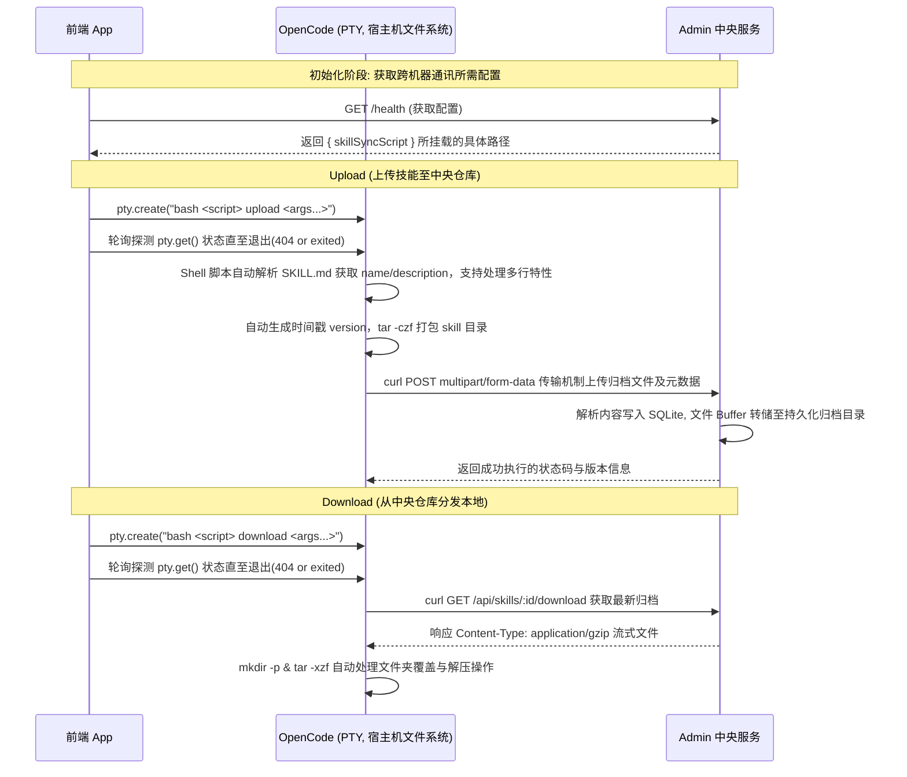

# 跨服务器 Skill 同步技术方案 (Skill Sync)

## 1. 背景与目标
在 OpenCode 体系中，前端应用 (`packages/app`)、OpenCode 核心服务 (`packages/opencode`) 以及中央管理服务 (`packages/admin`) 分布部署在不同的服务器环境中。
为了解决由于跨机器无法直接互操作文件系统（如直接在 Admin 后台读取并压缩 opencode 宿主机文件目录）的技术障碍，我们设计了以 **Shell 脚本 + PTY 驱动** 为核心的跨服务器同步传输方案。该方案具备高度的可移植性和低耦合度。

## 2. 总体架构

方案核心在于通过前端调用 OpenCode 提供的 PTY 终端模拟器接口 (`globalSDK.client.pty.create`) 执行本地的 `skill_sync.sh` 脚本来进行打包、通信和解压。为了克服前端 PTY Socket 连接长时间未响应的技术挑战与繁琐的状态管理，我们采用基于**定时轮询探测 (`pollPtyUntilDone`)** 的方式来探测脚本异步执行状态。



## 3. 核心机制设计与代码实现

### 3.1 前端驱动控制层：PTY 轮询探测状态机制
无需维护复杂的 WebSocket 链接生命周期管理。通过 `setInterval` 每隔 500ms 重复探询一次对应 PTY 会话状态。当 PTY 会话从缓存池中剔除返回接口级 `404` 或执行状态显式变为 `exited` 时，均被认为任务执行完成跳出轮询阻塞，通知上层执行相应业务逻辑刷新。

```typescript
// opencode/packages/app/src/pages/skills.tsx
/** 轮询 pty.get() 直到进程退出（返回 404 或 status=exited） */
const pollPtyUntilDone = (ptyId: string, timeout = 60000): Promise<void> => {
    return new Promise((resolve, reject) => {
        const start = Date.now()
        const timer = setInterval(async () => {
            if (Date.now() - start > timeout) {
                clearInterval(timer)
                reject(new Error("Timeout"))
                return
            }
            try {
                const result = await globalSDK.client.pty.get({ ptyID: ptyId, directory: currentDir() })
                if (!result?.data || (result.data as any).status === "exited") {
                    clearInterval(timer)
                    resolve()
                }
            } catch {
                // 404 = 进程执行完毕已销毁
                clearInterval(timer)
                resolve()
            }
        }, 500)
    })
}
```

### 3.2 系统调度层：统一收敛的 `skill_sync.sh` 脚本
设计提供单入口的多功能 Bash 脚本。摒弃了容易出现内存泄漏、阻塞等现象的跨进程 RPC 通信机制。
在信息提取领域，其具备高度兼容原生的极客特性：原生支持对 `SKILL.md` 的 Yaml-like 解析，尤其是利用 `awk/sed/grep` 处理 `description: |` 及后续跨任意多空行的 **YAML Block Scalar** 解析。网络层面采用管道重定向独立输出 Body / Header 以彻底杜绝格式耦合出错。

```bash
# opencode/scripts/skill_sync.sh 核心代码片段
# 解析 YAML frontmatter 中的 name 和 description (支持 description: | 多行块标量)
local NAME=""
local DESC=""
local IN_FRONTMATTER=0
local IN_MULTILINE=""

while IFS= read -r line; do
    # ... 省略部分 frontmatter --- 标记隔离代码
    if [ "$IN_FRONTMATTER" -eq 1 ]; then
        if [ -n "$IN_MULTILINE" ]; then
            # 宽容处理任意深度的空行 = 段落分隔，继续收集
            if [ -z "$line" ] || [ -z "$(echo "$line" | tr -d '[:space:]')" ]; then continue; fi
            # 以空格/tab开头 = 识别为合法续行，加入字符流
            if echo "$line" | grep -q '^[[:space:]]'; then
                local trimmed=$(echo "$line" | sed 's/^[[:space:]]*//')
                # 追加变量...
                continue
            else
                IN_MULTILINE="" # 检测到边界非缩进标记，退出多行解析状态机
            fi
        fi

        local key=$(echo "$line" | sed -n 's/^\([a-zA-Z_]*\):.*/\1/p')
        local value=$(echo "$line" | sed -n 's/^[a-zA-Z_]*:[[:space:]]*//p' | sed 's/^["'"'"']\(.*\)["'"'"']$/\1/')
        case "$key" in
            name) NAME="$value" ;;
            description)
                if [ "$value" = "|" ] || [ "$value" = ">" ]; then
                    DESC=""; IN_MULTILINE="description" # 进入多行探测状态机
                else
                    DESC="$value"
                fi
                ;;
        esac
    fi
done < "$SKILL_MD"

# 上传阶段采用独立挂载日志分离 CURL Body 与 Httpcode 的输出结果
local RESP_FILE="/tmp/skill_upload_resp_$$.json"
HTTP_CODE=$(curl -s -o "$RESP_FILE" -w "%{http_code}" \
    -X POST "$ADMIN_URL/api/skills" \
    -F "file=@$TMP_FILE" \ ...
```

### 3.3 数据持久服务层：分流传输模型解耦
删除了由中央网关承担解包编译安装工作的高度耦合的 `/install` 旧时路由端点。
Admin 服务职责彻底降维为 **元数据的验证/插入** 以及使用 `multipart/form-data` 接受文件缓冲上传，以及 `GET` 下发的资源分发服务器节点角色。

```typescript
// opencode/packages/admin/src/server/routes/skills.ts

// Multipart FormData 文件收口端点 (Upload)
app.post("/", async (c) => {
    const formData = await c.req.formData().catch(() => null)
    const file = formData.get("file") as File | null
    // 获取验证解析前端脚本发送的其余诸多元数据...

    // ... SQLite 执行 upsert 更新版本...

    // 承接 Buffer，剥离任何计算任务，落地挂载区存储
    const fileName = `${skillId}-${version}.tar.gz`
    const finalPath = join(STORAGE_DIR, fileName)
    const buffer = await file.arrayBuffer()
    await writeFile(finalPath, Buffer.from(buffer))

    return c.json({ ok: true, skillId, version })
})

// 流式下载分发端点 (Download)
app.get("/:id/download", async (c) => {
    // 权限与有效性检索...
    const file = Bun.file(latestVersion.path)
    c.header('Content-Type', 'application/gzip')
    c.header('Content-Disposition', `attachment; filename="${fileName}"`)
    
    // 纯 Buffer 流交还客户端 HTTP 上下文，降低堆栈占用
    return c.body(file.stream() as any)
})
```

## 4. 总结

该架构变更具备以下核心竞争力：
1. **网络无感**：完全摆脱在跨机器环境进行资源挂载路径直接映射的硬编码设计，极大提升了网络横向扩容节点时的稳健度。
2. **免除跨平台依赖**：前端仅依靠触发标准 Bash 指令环境工作，彻底摆脱跨机器进行复杂 IPC 或 RPC 子进程调用的繁琐设计。
3. **安全与资源管控**：Admin 节点降维脱离 CPU 密集型运算压力（脱离调用子进程解压缩职责），回归高效的内容存取节点角色。前端异步防挂起轮询实现杜绝内存泄漏和 Socket ZOMBIE 进程存在。
